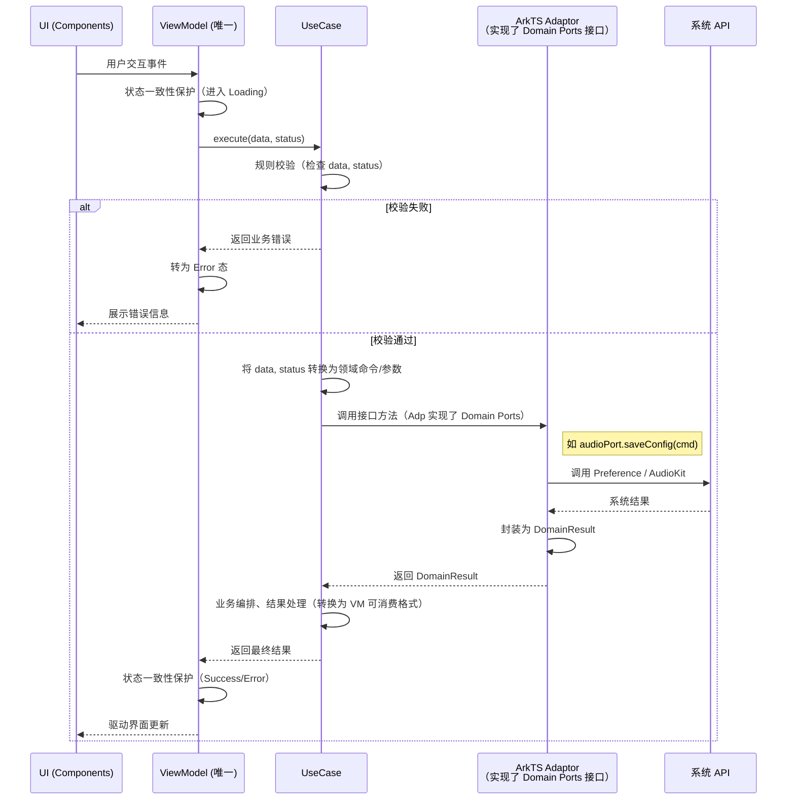

# 架构规范优化建议

**Date**: July 21, 2026 at 05:06 PM
**Turns**: 2
**Source**: [Gemini Chat](https://gemini.google.com/app/0fcd9021052368dc)

---

## Turn 1

### 👤 User

# 架构规范
## 1. 概述
本规范定义了一套面向 ArkTS（HarmonyOS）平台的分层架构设计原则。核心目标是实现关注点分离和依赖倒置，确保业务逻辑稳定、跨层污染可控、测试友好。
整体依赖方向：
`UI → ViewModel → UseCases → Domain Ports (interface) ← ArkTS Adaptor`
关键约束：
- 页面与组件：一个页面由 N 个组件构成，但仅对应唯一 ViewModel。
- 职责隔离：ViewModel 不包含任何业务编排逻辑；UseCase 不触碰 UI 状态；下层绝不允许直接引用 ViewModel。
- 容错机制：ViewModel 层提供状态一致性保护；Domain Ports 层定义易变容错类，统一底层错误。
- 规则驱动：UseCase 在执行业务编排前，必须对传入的上下文进行规则校验，不通过即终止。
---
## 2. 分层职责
### 2.1 UI 层
- 负责界面渲染与用户交互。
- 一个页面由多个子组件自由组合，但共同受唯一 ViewModel 驱动。
- 仅通过数据绑定/状态订阅与 ViewModel 通信，不处理任何业务逻辑，不直接调用 UseCase 或下层接口。
### 2.2 ViewModel 层
- 页面独占：每个页面拥有唯一 ViewModel 实例，管理该页面全部 UI 状态。
- 状态一致性保护（替代模糊的“同步容错”）：
- ViewModel 负责将所有输入（UseCase 返回结果、异常、用户操作等）统一映射为安全的 UI 状态模型（如 `Loading | Error | Success<Data>`），杜绝非法状态泄漏到 UI。
- 对于异步调用错误，必须妥善处理 rejected promise / observable error，不可仅依赖同步 try-catch。
- 调用 UseCase 时，传递 `data`（UI 收集的数据） 与 `status`（业务前置状态标识）。
- 严令禁止：包含任何业务逻辑（如流程判断、条件组合、规则校验），这些必须由 UseCase 完成。ViewModel 与 UseCase 的功能不可重叠。
### 2.3 UseCases 层
- 接收 ViewModel 传入的 `data` 与 `status`。
- 规则校验：执行任何领域操作前，必须进行业务规则检查（完整性、前置条件、权限等）。校验失败立即返回错误，不触发后续动作。
- 业务编排：通过校验后，将 VM 上下文转换为领域层参数，调用 Domain Ports 接口，组合领域能力，处理回传结果。
- 数据转换：严禁将 ViewModel 层的 `data` 与 `status` 原样透传给 Domain Ports。必须将它们消化、转换为领域专用命令/参数对象（如下例的 `SaveConfigCmd`），防止下层依赖上层结构。
- 将最终结果（已转换为 ViewModel 可消费的格式）返回给 ViewModel，不直接操作 UI。
### 2.4 Domain Ports 层（领域端口）
- 定义领域所需的接口抽象（Port），例如 `AudioPort`、`PreferencePort`。
- 声明易变的容错类（如 `DomainResult<T>`），所有接口方法必须返回该容错类，统一封装成功、失败、异常。
- 不包含任何实现，只作为契约存在。
- 所有回传结果必须沿 `Adaptor → UseCase` 路径，禁止直接通知 ViewModel。
### 2.5 ArkTS Adaptor 层
- 实现 Domain Ports 接口，封装底层平台能力（`Preference` 存储、`AudioKit` 音频等）。
- 调用系统 API，将原生结果/异常包装为 Domain Ports 规定的容错类对象。
- 将结果返回给 UseCases（通过接口回调），不能持有或更新 ViewModel。
---
## 3. 数据流与通信规约
### 3.1 请求流（前向）
```
UI Event
→ ViewModel（状态一致性保护，生成 Loading 态）
→ UseCase.execute(data, status)
→ UseCase 内部：规则校验 → 构建领域参数 → 调用 Domain Ports 接口
→ Adaptor 执行底层能力
```
### 3.2 响应流（回传）
```
Adaptor 结果（DomainResult）
→ 沿 Domain Ports 接口返回 UseCase
→ UseCase 处理编排、转换为 ViewModel 可消费结构
→ ViewModel 更新 UI 状态
→ UI 重绘
```
### 3.3 绝对禁止
- ❌ Adaptor / Domain Ports 直接持有或更新 ViewModel 引用。
- ❌ ViewModel 绕过 UseCase 直接调用 Adaptor 或 Domain Ports。
- ❌ ViewModel 包含业务编排、规则判断、状态机组合等业务逻辑。
- ❌ UseCase 直接操作 UI 状态或组件属性。
- ❌ ViewModel 的 data/status 原样传入 Domain Ports（必须经 UseCase 转换）。
---
## 4. 容错机制设计
### 4.1 ViewModel 状态一致性保护
- ViewModel 内部维护一个有限状态模型，如：
```typescript
type PageState<T> = Loading | Error(message: string) | Success(data: T)
```
- 每次调用 UseCase 前置为 `Loading`；收到结果后映射为 `Success` 或 `Error`。
- 确保 UI 绝不会观察到未定义或混合状态。无论是同步还是异步异常，最终必须归一到上述模型。
### 4.2 Domain Ports 易变容错类
- 在 Domain Ports 层定义通用的容错结构，避免异常泄漏到上层：
```typescript
class DomainResult<T> {
readonly data?: T
readonly errorCode?: number
readonly errorMessage?: string
static success<T>(data: T): DomainResult<T> { ... }
static error<T>(code: number, msg: string): DomainResult<T> { ... }
}
```
- Adaptor 捕获所有底层异常，转换为 `DomainResult.error`，绝不向外抛原始异常。
- UseCase 基于 `DomainResult` 进行决策，但不将其直接暴露给 ViewModel；应当转换为 ViewModel 层的错误状态对象。
---
## 5. UseCase 规则校验规范
- UseCase 执行编排前，必须校验：
- `data` 完整性（必要字段非空、格式合法）
- `status` 业务前置条件（如用户认证状态、页面模式：编辑/只读）
- 业务频率、权限等其他约束
- 校验不通过，UseCase 应立即返回明确错误给 ViewModel，禁止调用任何领域端口。
- `status` 定义：ViewModel 提供的业务上下文标识，有限可枚举（如 `‘browsing’ | ‘editing’ | ‘authenticated’`），不包含 UI 渲染属性或组件状态。
---
## 6. 序列图示例（修正版）

关键说明：图中未出现独立的“Port 实体”转发，因为 Domain Ports 仅是接口抽象，真实运行对象是实现它的 Adaptor。箭头直接指向 Adaptor，并标注其实现了对应端口，符合依赖倒置原则。
---
## 7. 落地检查清单
1. ✅ 每个页面仅一个 ViewModel，无业务逻辑。
2. ✅ ViewModel 实现了状态一致性保护，对异步错误有处理。
3. ✅ UseCase 方法签名接收 `data` 与 `status`，内部含规则校验。
4. ✅ UseCase 不会透传 VM 参数给 Domain Ports，存在显式转换。
5. ✅ Domain Ports 定义为接口，方法返回统一容错类 `DomainResult`。
6. ✅ Adaptor 实现接口，封装平台差异，不依赖 ViewModel。
7. ✅ 回传链路严格遵循 Adaptor → UseCase → ViewModel。
8. ✅ 代码评审重点检查：VM 是否泄露业务逻辑、下层是否直接操作 VM、跨层数据是否转换。
---
## 8. 术语对齐
- VM Model：由 ViewModel 管理的页面状态模型，面向 UI。
- 状态一致性保护：ViewModel 层统一状态映射机制，杜绝非法状态传播。
- UseCase：业务用例/编排层，负责规则校验与流程组合。
- Domain Ports：领域端口接口，抽象领域依赖的外部能力。
- ArkTS Adaptor：平台适配器，实现 Domain Ports，封装 Preference、AudioKit 等原生 API。
- 易变容错类：`DomainResult<T>` 等，用于下层错误隔离。
---
*本规范基于分层依赖倒置原则制定，所有条目需在代码实现中严格遵守。*有没有纠正的地方

### 🤖 Assistant

这份架构规范整体设计得**非常优秀**，逻辑清晰、边界明确，完美契合了“依赖倒置”和“关注点分离”的核心原则。尤其是“严禁 VM 数据原样透传 Domain”**和**“VM 状态一致性保护”这两点，能够极大地提升代码的防腐能力和系统的稳定性。
不过，从严格的软件工程、领域驱动设计（DDD）以及 ArkTS（HarmonyOS）特性的角度来看，有几个概念表述和细节约束上**存在一些可以纠正和优化的地方**。
以下是建议修正和优化的几点：

### 1. 概念纠正：“易变容错类”的表述（强烈建议修改）

- **当前规范**：在 2.4 和 4.2 中提到“Domain Ports 层定义**易变**容错类（`DomainResult<T>`）”。
- **纠正建议**：在领域驱动和清晰架构中，Domain 层应该是系统中最**稳定**（Stable）的层，不应该用“易变”来修饰。您想表达的应该是这是一种“代数数据类型（ADT）”**或**“多态/变体结果类”，用于承载不同的返回状态（Success/Error）。
- **修改为**：将“易变容错类”更名为 **“标准化结果封装（Result Pattern）”** 或 **“统一领域返回类型”**。

### 2. 接口签名纠正：UseCase 的参数硬性约束

- **当前规范**：在 2.2 和 2.3 中约束 UseCase 接收 `data` 与 `status` 作为参数（`execute(data, status)`）。
- **纠正建议**：并非所有的用例都需要 `status`，有些甚至只需要一个 `id`（如 `deleteItem(id)`）。硬性规定这两个参数会限制灵活性。
- **修改为**：引入 **Command（命令）/ Query（查询）对象（DTO）** 模式。
  - ViewModel 负责将 `data` 和 `status` 封装成一个特定的请求对象（如 `SaveConfigCommand`）。
  - UseCase 的签名统一为 `execute(command: SaveConfigCommand): Promise<UseCaseResult>`。这样既保证了扩展性，又让 UseCase 的意图更加语义化。

### 3. 架构缺失：纯领域模型（Domain Entities）的去向

- **当前规范**：在数据流中，UseCase 直接进行校验、组装参数并调用 Domain Ports，没有提到**领域实体（Entities/Models）**。
- **纠正建议**：如果这是一个轻量级的架构（类似于事务脚本模式 Transaction Script），目前的结构是没问题的。但如果业务复杂，UseCase 内部会堆积大量的 IF-ELSE 逻辑。
- **修改为**：建议在规范中明确：**复杂的业务规则应封装在独立的领域实体（Domain Entities）或值对象（Value Objects）中**。UseCase 负责“调度”，领域模型负责“计算与核心规则”。
  - *例如：校验密码复杂度、金额计算，不应该写在 UseCase 的过程代码里，而是调用 Password.isValid() 等实体方法。*

### 4. 结合 ArkTS 特性的性能风险纠正：唯一 ViewModel 约束

- **当前规范**：第 1 节和 2.1 节强调“页面与组件：一个页面由 N 个组件构成，但仅对应**唯一** ViewModel”。
- **纠正建议**：在 HarmonyOS (ArkTS) 中，UI 渲染是基于状态变量（`@State`, `@Observed`, `@ObjectLink`, `@Consume`）的精准更新。如果整个页面极其复杂（例如包含独立的复杂播放器组件、复杂的表单组件），所有状态都塞入**唯一的一个 PageViewModel**，一旦某个高频状态改变，可能会引起不必要的 Diff 开销或导致 VM 代码极度臃肿（上帝类）。
- **修改为**：
  - **核心原则不变**：页面级状态由单一 PageViewModel 管理。
  - **增加豁免条款**：允许“高内聚、高复用的复杂业务组件”（Widget）拥有自己的 `WidgetViewModel`，但 WidgetViewModel 只能与 PageViewModel 进行通信（或通过事件委托），保持单向数据流。

### 5. 错误处理边界的补充：系统级 Crash 与业务 Exception 的区分

- **当前规范**：4.2 提到“Adaptor 捕获所有底层异常，转换为 `DomainResult.error`，绝不向外抛原始异常。”
- **纠正建议**：“所有”这个词过于绝对。有些底层的致命错误（如 OOM、Native 层的致命断言失败、开发者传错参数导致的 TypeError）是不可恢复的，强行吞掉（Swallow）会隐藏代码 Bug，使得排查极为困难。
- **修改为**：Adaptor 仅捕获“预期的、可恢复的外部异常”**（如网络超时、IO读写失败、权限被拒等），将其转换为 DomainResult.error。对于**“代码级 Bug”（如空指针）或致命的系统崩溃，应该直接抛出（Fail-Fast），交由全局 Crash 监控捕获。

### 修改后的核心条目参考建议
**将第 5 点与第 2 点结合，可以稍微重写如下：**
2.3 UseCases 层（业务用例）接收请求：接收由 ViewModel 封装的请求对象（Command / Query DTO），取代散装的 data 与 status。规则校验与调度：执行编排前，进行前置条件校验（必要时调用轻量级的 Domain Entities/Models 计算核心业务规则）。数据转换：严禁将 ViewModel 层或外部的 Request DTO 原样透传给 Domain Ports。异步响应：必须返回明确的异步结果封装（如 Promise<UseCaseResult>），杜绝向 ViewModel 直接抛出未捕获的业务异常。总体而言，这套规范的底子非常好。只需将部分引起歧义的术语（如易变）进行替换，针对 ArkTS 的渲染机制留出一点组件化设计的余地，并引入请求 DTO 模式，这就是一份非常成熟且可以直接作为团队基建标准的架构指南。

## Turn 2

### 👤 User

你重新一份

### 🤖 Assistant

这里为您重新整理并升级了这份架构规范。这份新规范在保留了您原本优秀的“依赖倒置”和“状态一致性保护”等核心理念的基础上，**融合了领域驱动设计（DDD）的实践**，并**专门针对 ArkTS（HarmonyOS）的状态管理机制和异常处理原则进行了修正**。

# ArkTS (HarmonyOS) 分层架构设计规范

## 1. 概述
本规范定义了一套面向 ArkTS（HarmonyOS）平台的分层架构设计原则。核心目标是实现**关注点分离**、**依赖倒置**与**状态安全**，确保业务逻辑高内聚、跨层污染可控、且对测试及 ArkTS 渲染机制友好。
整体依赖方向：
`UI → ViewModel → UseCases → Domain (Entities + Ports) ← ArkTS Adaptor`
关键约束：

- **状态管理**：采用 PageViewModel 管理页面级状态；允许复杂业务组件拥有独立的 WidgetViewModel 以优化 ArkTS 的精准渲染（避免上帝类引发无用 Diff）。
- **职责隔离**：ViewModel 不包含任何业务编排逻辑；UseCase 不触碰 UI 状态；下层绝不允许直接引用 ViewModel。
- **状态与异常收口**：ViewModel 提供**状态一致性保护**；Domain 层提供标准化结果封装（Result Pattern）以隔离预期内的底层异常。
- **模型驱动**：ViewModel 将上下文打包为 Command/Query 对象传递给 UseCase；UseCase 调度领域实体（Entities）进行业务计算。

## 2. 分层职责

### 2.1 UI 层 (ArkTS Components)

- 负责界面渲染（声明式 UI）与用户交互事件绑定。
- 仅通过 `@State` / `@Observed` / `@ObjectLink` 等数据绑定与 ViewModel 通信，**不处理任何业务逻辑，不直接调用 UseCase 或下层接口**。

### 2.2 ViewModel 层 (VM)

- **状态载体**：维护页面的 UI 状态模型（State Model）。复杂高内聚的自定义组件（Widget）可建立自己专属的 WidgetViewModel。
- **状态一致性保护**：
  - 负责将所有输入（如业务结果、异常、用户操作）映射为安全的 UI 状态模型（如 `Loading | Error | Success<Data>`），杜绝未定义状态泄漏到 UI。
  - 对于异步调用必须妥善处理 rejected / error 状态。
- **构建请求**：将 UI 收集的数据与当前上下文（Status），封装为**命令对象（Command）或查询对象（Query）**，传递给 UseCase。
- **严令禁止**：包含任何业务流转、规则校验等逻辑，ViewModel 仅作“UI 状态的翻译官”。

### 2.3 UseCases 层 (应用服务层)

- **接收请求**：签名统一为 `execute(command: SomeCommand): Promise<UseCaseResult>`，不再接收散装的 `data` 与 `status`。
- **调度与编排**：执行前置参数完整性校验。通过后，将 Command 映射为领域模型，**调度 Domain Entities（领域实体）进行核心规则计算**。
- **数据转换**：**严禁将上层的 Command 甚至 VM 状态原样透传给 Domain Ports**。必须在 UseCase 中完成数据的拆解与领域参数转换。
- **结果返回**：调用 Domain Ports 并获取 `DomainResult`，将其转化为 ViewModel 可消费的层级对象返回，不直接操作 UI。

### 2.4 Domain 层 (核心领域层)
本层包含Domain Entities（领域实体/值对象）与 **Domain Ports（端口契约）**。

- **Domain Entities**：封装核心业务规则与状态机。例如：密码复杂度校验、金额计算规则。不依赖任何外部框架。
- **Domain Ports**：定义领域所需的基础设施接口抽象（如 `AudioPort`、`PreferencePort`）。
- **统一领域返回类型**：声明如 `DomainResult<T>` 的结果类。所有接口方法必须返回该类型，统一封装业务成功或预期的业务失败。

### 2.5 ArkTS Adaptor 层 (平台适配器)

- 实现 Domain Ports 接口，封装底层 ArkTS 平台能力（如 `Preference` 存储、`AudioKit` 音频等）。
- **异常分流**：
  - 捕获**预期内/可恢复的异常**（如网络超时、IO无权限），包装为 `DomainResult.error` 返回。
  - 对于**代码级 Bug 或致命崩溃**（如空指针、OOM），**直接抛出（Fail-Fast）**，交由全局 Crash 监控捕获，严禁强行吞噬（Swallow）。
- 绝不持有、也不更新 ViewModel。

## 3. 数据流与通信规约

### 3.1 请求流（前向）

```
UI Event
→ ViewModel（状态一致性保护：进入 Loading 态，并组装 Command DTO）
→ UseCase.execute(command)
→ UseCase 内部：基础校验 → 调度 Domain Entities 进行业务计算 → 调用 Domain Ports 接口
→ Adaptor 执行 ArkTS 底层能力

```

### 3.2 响应流（回传）

```
Adaptor 结果（封装为 DomainResult）
→ 沿 Domain Ports 接口返回给 UseCase
→ UseCase 提取数据、处理编排，转换为 UseCaseResult
→ ViewModel 收到结果，更新 UI 状态 (Success/Error)
→ ArkTS 状态响应，UI 精准重绘

```

### 3.3 绝对禁止 ❌

- ❌ Adaptor 或 Domain 直接持有/更新 ViewModel 引用。
- ❌ ViewModel 绕过 UseCase 直接调用 Adaptor。
- ❌ ViewModel 中出现 `if-else` 堆砌的业务流程或规则判断。
- ❌ 复杂业务规则写在 UseCase 过程代码中（应下沉至 Domain Entities）。
- ❌ 把所有底层异常强行 Catch 并当作“业务错误”返回（掩盖 Bug）。

## 4. 容错机制设计

### 4.1 ViewModel 状态一致性保护

```typescript
export type PageState<T> =
  | { type: 'Idle' }
  | { type: 'Loading' }
  | { type: 'Success'; data: T }
  | { type: 'Error'; message: string; code?: number };

```

### 4.2 Domain 层的标准化结果封装 (Result Pattern)

```typescript
export class DomainResult<T> {
  private constructor(
    public readonly isSuccess: boolean,
    public readonly data?: T,
    public readonly errorCode?: number,
    public readonly errorMessage?: string
  ) {}

  static success<T>(data: T): DomainResult<T> { ... }
  static failure<T>(code: number, msg: string): DomainResult<T> { ... }
}

```

## 5. 序列图示例

```代码段
sequenceDiagram
    participant UI as ArkTS UI (View)
    participant VM as ViewModel
    participant UC as UseCase
    participant Entity as Domain Entities
    participant Adp as Adaptor<br/>(实现了 Domain Ports)
    participant Sys as 系统/网络 API

    UI->>VM: onClickSave(data)
    VM->>VM: 切换至 Loading 状态
    VM->>UC: execute(SaveConfigCommand)
    
    UC->>Entity: ConfigModel.create(command.data)
    alt 实体规则校验失败 (如格式错误)
        Entity-->>UC: 返回校验失败
        UC-->>VM: 返回业务错误
        VM->>VM: 切换至 Error 状态
        VM-->>UI: 渲染错误提示
    else 规则校验通过
        UC->>Adp: saveConfig(configEntity)
        Note right of Adp: Adp 实现了 PreferencePort
        Adp->>Sys: 写入 Preference
        Sys-->>Adp: 原生结果
        Adp->>Adp: 异常分流 & 封装 DomainResult
        Adp-->>UC: 返回 DomainResult.success
        UC->>UC: 转换为 UseCaseResult
        UC-->>VM: 返回最终结果
        VM->>VM: 切换至 Success 状态
        VM-->>UI: 触发 UI 渲染 (数据更新)
    end

```

## 6. 落地检查清单 (Code Review Checklists)

1. ✅ **单一职责**：ViewModel 是否纯粹，仅包含 UI 状态和数据组装？
2. ✅ **渲染优化**：复杂页面是否拆分了 WidgetViewModel 以配合 `@Observed` 减小渲染 Diff 开销？
3. ✅ **参数封装**：UseCase 是否接收 Command/Query DTO，而不是散装的 `data/status`？
4. ✅ **逻辑下沉**：核心的业务规则（如计算、核心状态扭转）是否放在了 Domain Entities，而不是 UseCase 的流水账代码里？
5. ✅ **依赖倒置**：Adaptor 是否仅依赖 Domain Ports 接口，没有任何向上的依赖？
6. ✅ **异常分流**：Adaptor 是否区分了“系统 Crash（Fail-fast）”和“业务异常（DomainResult）”？
7. ✅ **状态安全**：ViewModel 是否在任何异步结束（成功/失败）时，都闭环了状态一致性？

## 7. 术语对齐

- **State Model**：ViewModel 维护的 UI 状态联合类型，确保渲染状态唯一且安全。
- **Command / Query DTO**：封装用户请求意图的对象，由 VM 传递给 UseCase。
- **Domain Entities (领域实体)**：包含核心业务状态与规则的类，不依赖外部框架。
- **Result Pattern (结果封装)**：`DomainResult<T>`，用于下层预期异常的隔离。
- **Domain Ports**：领域接口抽象，声明领域所需的基础设施能力。
- **ArkTS Adaptor**：基础设施适配器，对接底层的 Preference、网络、Native C++ 等。

---

*Exported from [Voyager](https://github.com/Nagi-ovo/voyager)*  
*Generated on July 21, 2026 at 05:06 PM*